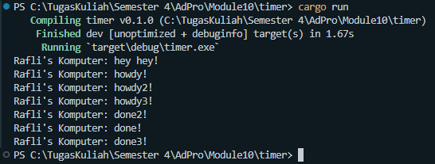

## 1.2. Understanding how it works

  
Berdasarkan lampiran diatas, terlihat bahwa pertama-tama output akan menampilkan "Rafli's Komputer: hey hey!" terlebih dahulu sebelum menampilkan perintah-perintah yang berada pada task di dalam spawner. Ini terjadi, karena baris tersebut dieksekusi sebelum line `drop(spawner)` dan `executor.run()` yang berarti pesan ini dicetak sebelum task yang di spawn mulai dijalankan oleh executor. Ketika executor dijalankan, task yang telah di spawn sebelumnya baru akhirnya mulai bekerja. Lalu output mulai menampilkan "Rafli's Komputer: howdy!" dan setelah 2 detik kemudian menampilkan "Rafli's Komputer: done!". Jadi, kesimpulannya "Rafli's Komputer: hey hey!" akan tercetak duluan karena dieksekusi langsung di thread utama sebelum executor memulai task asinkron yang di *spawn*.  

## 1.3. Multiple Spawn and removing drop

  
  
  
Berdasarkan lampiran diatas, terlihat bahwa sekarang terdapat beberapa task yang dijadwalkan untuk dijalankan melalui *spawner* dan sebuah *executor* yang mengatur eksekusi task-task tersebut. Lalu, terlihat juga bahwa terdapat perbedaan ketika `drop(spawner)` di-*comment* dan digunakan. Ketika `drop(spawner)` digunakan, *executor* akan mengetahui bahwa tidak ada lagi task baru yang akan dikirim, sehingga memungkinkan *executor* untuk berhenti setelah semua task yang berada di dalam antrian selesai dijalankan. Namun, ketika `drop(spawner)` di-*comment* maka *executor* tidak menerima kabar apakah task sudah tidak ada lagi. Ini akan menyebabkan *executor* akan terus berjalan, menunggu task baru yang tidak pernah datang.  

Lalu, selain hal diatas dapat diperhatikan juga bahwa pada lampiran foto-foto tersebut urutan print done bisa berbeda dikarenakan setiap task memiliki waktu tunggu yang sama yaitu 2 detik, maka urutan eksekusi mereka setelah waktu tunggu bergantung kepada *executor* menjadwalkan task-task tersebut. *Executor* mungkin menjalankan task dalam urutan yang tidak terduga karena nature asinkron dan konkurensi dari sistem.  